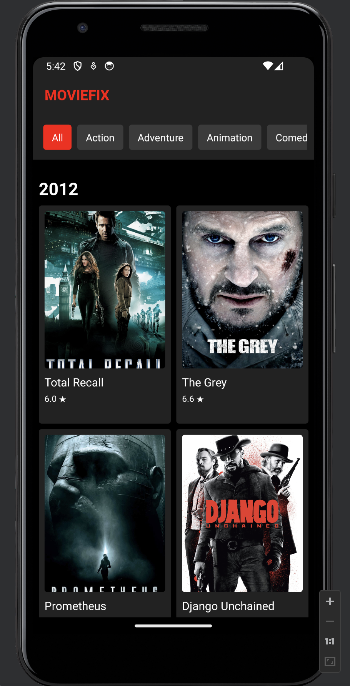
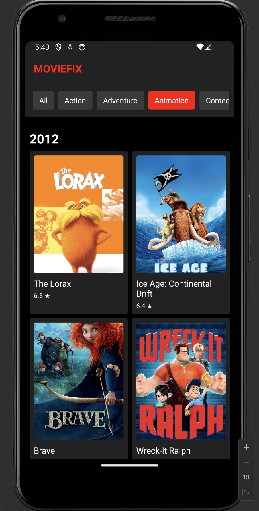
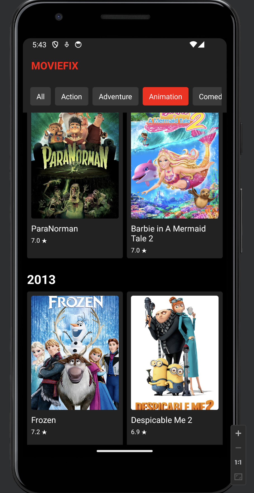

# Getting Started

## Make sure you have following installations:

1. npm installed
2. node version 20 or above
3. java version 17 or above
4. path setup for java and android sdk

## Follow below steps to run the app:

1. redirect to project folder
2. run > <kbd>npm i</kbd>
3. run > <kbd>npm start</kbd>
4. press <kbd>a</kbd> to run app on android
5. press <kbd>r</kbd> to reload the app if required

## Sample screenshots:

[Recording](sample/FCMovieRecording.mov)

